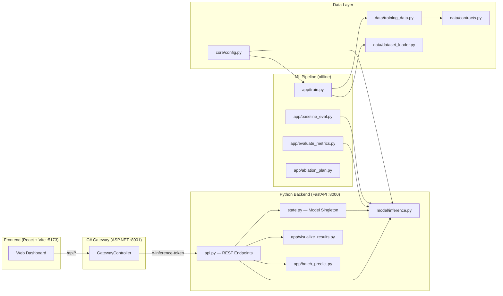

<div align="center">

# 🇹🇷 Turkish Sentiment Analysis

**Production-ready sentence-level sentiment classification powered by BERTurk**

[](https://python.org)
[](https://fastapi.tiangolo.com)
[](https://react.dev)
[](#testing)
[](LICENSE)

*Classify Turkish text as **Negative · Neutral · Positive** with confidence scores, batch processing, and a real-time dashboard.*

</div>

---

## Table of Contents

1. [Overview](#overview)
2. [Architecture](#architecture)
3. [Project Structure](#project-structure)
4. [Quick Start](#quick-start)
5. [Module Reference](#module-reference)
6. [Data Files](#data-files)
7. [Output Artifacts](#output-artifacts)
8. [REST API Reference](#rest-api-reference)
9. [Frontend Dashboard](#frontend-dashboard)
10. [Configuration](#configuration)
11. [Confidence Fallback Policy](#confidence-fallback-policy)
12. [Testing](#testing)
13. [End-to-End Workflows](#end-to-end-workflows)
14. [Troubleshooting](#troubleshooting)
15. [Scope & Limitations](#scope--limitations)
16. [Onboarding Guide](#onboarding-guide)

---

## Overview

This project builds, trains, evaluates, and serves a **Turkish sentence-level sentiment classifier** using a fine-tuned [BERTurk](https://huggingface.co/dbmdz/bert-base-turkish-cased) model. The system is designed for real-world deployment with:

- **Hybrid backend** — Python (FastAPI) for ML inference + C# (ASP.NET Core) for API gateway
- **Interactive dashboard** — React + Vite frontend with dark mode, pagination, and live health status
- **Batch inference** — Efficient batched tokenization for high-throughput prediction
- **Confidence fallback** — Configurable threshold to suppress low-confidence predictions
- **Ablation study** — 2³ factorial design for systematic hyperparameter evaluation
- **Comprehensive testing** — 48 unit + integration tests across data contracts, schemas, inference, and API

---

## Architecture



**Request flow:** Browser → Vite dev proxy (`/api`) → C# Gateway (`:8001`, optional `x-api-key` auth) → Python Backend (`:8000`, `x-inference-token` auth) → BERTurk model → JSON response.

---

## Project Structure

```
ABSA/
├── backend/                  # Python FastAPI inference service
│   ├── main.py               # App entry point, CORS, logging, request-ID middleware
│   ├── api.py                # REST endpoint definitions
│   ├── schemas.py            # Pydantic request/response models
│   └── state.py              # Singleton model holder (lifespan-managed)
├── backend-csharp/           # ASP.NET Core gateway (optional auth layer)
├── frontend/                 # React + Vite dashboard
│   └── src/components/       # ErrorBoundary, SinglePrediction, BatchPrediction, Header
├── src/
│   ├── core/                 # Central configuration and progress utilities
│   │   ├── config.py         # All file paths, hyperparameters, and feature flags
│   │   └── progress.py       # Terminal progress bars (track, loader_total)
│   ├── data/                 # Data standardization and preparation
│   │   ├── contracts.py      # Column normalization, polarity mapping, deduplication
│   │   ├── training_data.py  # Training pool assembly (CSV + HF + hard examples)
│   │   └── dataset_loader.py # PyTorch Dataset for tokenized sentence tensors
│   ├── model/                # Model loading, training, and inference
│   │   ├── loader.py         # Safe model loading (weights_only=True, shape validation)
│   │   ├── trainer.py        # Training loop, loss, checkpointing, early stopping
│   │   └── inference.py      # Single/batch prediction with confidence fallback
│   └── app/                  # Orchestration scripts and CLI tools
│       ├── train.py          # End-to-end training orchestrator
│       ├── predict.py        # Interactive single-sentence prediction
│       ├── batch_predict.py  # Batched CSV prediction with efficient tokenization
│       ├── evaluate_metrics.py  # Test-set evaluation (report, confusion matrix)
│       ├── visualize_results.py # Sentiment distribution chart generation
│       ├── baseline_eval.py  # Majority / TF-IDF / BERT baseline comparison
│       ├── ablation_plan.py  # 2³ ablation matrix generator
│       └── multi_seed_train.py  # Multi-seed training for variance estimation
├── tests/                    # Pytest test suite (48 tests)
│   ├── conftest.py           # Shared fixtures (mock models, sample DataFrames)
│   ├── test_contracts.py     # Data contract unit tests
│   ├── test_schemas.py       # Pydantic schema validation tests
│   ├── test_inference.py     # Inference and fallback logic tests
│   └── test_api.py           # FastAPI endpoint integration tests
├── scripts/                  # Helper scripts (Colab runner, sequence length inspector)
├── data/                     # Training/validation/test CSV files
├── models/                   # Trained model weights (.bin)
├── start-dev.ps1             # One-command development server launcher
├── requirements.txt          # Python dependencies (pinned ranges)
└── pyproject.toml            # Project metadata and pytest configuration
```

---

## Quick Start

### Prerequisites

- Python 3.12+ with pip
- Node.js 18+ with npm
- .NET 8 SDK (optional, for C# gateway)

### Installation

```bash
# 1. Clone the repository
git clone <repo-url> && cd ABSA

# 2. Create Python virtual environment
python -m venv .venv
.venv\Scripts\activate          # Windows
# source .venv/bin/activate     # Linux/macOS

# 3. Install Python dependencies
pip install -r requirements.txt

# 4. Install frontend dependencies
cd frontend && npm install && cd ..
```

### Running the Development Stack

```powershell
.\start-dev.ps1
```

This launches three services in separate terminal windows:

| Service | URL | Purpose |
|---|---|---|
| **Python Backend** | `http://127.0.0.1:8000` | ML inference (FastAPI) |
| **C# Gateway** | `http://127.0.0.1:8001` | API orchestration + auth |
| **Frontend** | `http://127.0.0.1:5173` | React dashboard |

> **Note:** Model loading takes ~10 seconds. The dashboard will show **"System Ready"** once the model is available.

### Training a Model

```bash
python -m src.app.train
```

### Running Tests

```bash
python -m pytest tests/ -v
```

---

## Module Reference

### Core (`src/core/`)

| Module | Responsibility |
|---|---|
| `config.py` | Central configuration hub — file paths, model name, training hyperparameters, early stopping settings, data merge options, and feature flags. All other modules read from here. |
| `progress.py` | Terminal progress bars (`track`, `loader_total`) used during training, evaluation, batch prediction, and HuggingFace data loading. |

### Data Layer (`src/data/`)

| Module | Responsibility |
|---|---|
| `contracts.py` | Defines the data format contract. Normalizes `Sentence` and `Polarity` columns from various aliases and formats. Deduplicates sentences by majority-vote label. |
| `training_data.py` | Assembles the training pool: merges the main CSV, optional raw ABSA data, optional HuggingFace supplementary data, and optional hard-example overrides. Includes leakage guard to detect and remove train/val sentence overlap. |
| `dataset_loader.py` | Converts cleaned DataFrames into PyTorch `Dataset` objects — tokenizes sentences into `input_ids` + `attention_mask` tensors. |

### Model (`src/model/`)

| Module | Responsibility |
|---|---|
| `loader.py` | Safely loads the trained model file (`weights_only=True`). Validates classifier layer shape to catch architecture mismatches early. Returns the model and tokenizer ready for inference. |
| `trainer.py` | The training loop engine — loss computation, per-epoch train/eval passes, checkpoint saving, and early stopping. |
| `inference.py` | Prediction helpers. Generates labels, probabilities, and metadata for single sentences. Implements the confidence fallback mechanism. |

### Application (`src/app/`)

| Module | Responsibility |
|---|---|
| `train.py` | Top-level training orchestrator. Coordinates data preparation, model setup, and training initiation. |
| `predict.py` | Interactive CLI for single-sentence manual prediction. |
| `batch_predict.py` | Batch prediction using efficient batched tokenization. Shared by both CLI and API endpoints. |
| `evaluate_metrics.py` | Test-set performance measurement. Produces classification report, confusion matrix, and error analysis CSVs. |
| `visualize_results.py` | Renders batch prediction results as sentiment distribution charts. |
| `baseline_eval.py` | Generates Majority + TF-IDF + BERT comparison on the same test set. |
| `ablation_plan.py` | Generates the 2³ ablation matrix (`ablation_plan.csv`) for systematic hyperparameter study. |
| `multi_seed_train.py` | Runs the full training pipeline across multiple random seeds (default: 42, 123, 456) and reports mean ± std of validation macro-F1. |

### Service Layer (`backend/`)

| Module | Responsibility |
|---|---|
| `main.py` | FastAPI application — CORS policy, structured logging, request-ID tracing middleware, and lifespan-managed model loading. |
| `state.py` | In-memory singleton for the loaded model, tokenizer, and device. |
| `api.py` | Public HTTP endpoints for prediction, visualization, and system health. |
| `schemas.py` | Pydantic request/response schemas with validation constraints and batch size limits. |
| `backend-csharp/` | ASP.NET Core gateway — optional client API key and internal inference token for secure orchestration. |

---

## Data Files

| File | Expected Schema | Purpose |
|---|---|---|
| `data/turkish_absa_train.csv` | Raw ABSA-compatible format | Preprocessing / training pool |
| `data/train.csv` | `Sentence`, `Polarity` | Model training |
| `data/val.csv` | `Sentence`, `Polarity` | Validation during training |
| `data/test.csv` | `Sentence`, `Polarity` | Final performance evaluation |
| `data/hard_examples.csv` | Difficult samples with manual labels | Strengthening the model on edge cases |
| `data/sample_tweets.csv` | Input texts for batch prediction | Batch inference |

> **Polarity values:** `0 = Negative`, `1 = Neutral`, `2 = Positive`. Duplicate sentences are deduplicated by majority vote. When hard examples are enabled, their labels take priority over conflicting entries.

---

## Output Artifacts

All outputs are organized under `data/outputs/<run_name>/`, where `run_name` is set by `OUTPUT_RUN_NAME` in `src/core/config.py`.

| Artifact | Path | Description |
|---|---|---|
| Trained model | `models/sentence_best_model.bin` | The production model binary |
| Experiment summary | `experiment_last_run.json` | Config snapshot + per-epoch metrics |
| Baseline comparison | `baseline_comparison.csv` | Majority / TF-IDF / BERT comparison |
| Baseline class report | `baseline_class_reports.csv` | Per-model class-level metrics |
| Batch predictions | `sentiment_batch_results.csv` | Per-text label + confidence score |
| Confusion matrix | `confusion_matrix.png` | Visual class confusion analysis |
| Misclassified examples | `test_misclassified.csv` | Incorrectly predicted rows |
| Confusion pairs | `test_confusion_pairs.csv` | Most-confused class pairs |
| Leakage report | `leakage_report.json` | Train/val overlap detection report |
| Ablation plan | `ablation_plan.csv` | 8-row `abl_01`–`abl_08` run matrix |
| Sentiment chart | `chart_sentiment_distribution.png` | Positive/Neutral/Negative distribution |

---

## REST API Reference

> **Interactive docs:** Visit `/docs` (Swagger UI) when the backend is running.

These endpoints serve **production inference and visualization only**. Training, test-set metrics, and baseline scripts are CLI-only and not exposed via the API.

| Endpoint | Method | Description |
|---|---|---|
| `/health` | `GET` | Service status and model load state |
| `/meta` | `GET` | Model name, class list, confidence threshold, fallback settings |
| `/predict` | `POST` | Single text → sentiment, probabilities, raw label, fallback info |
| `/predict/batch` | `POST` | Up to 500 texts → per-item prediction list |
| `/predict/batch/upload` | `POST` | CSV file upload → batch predictions + distribution statistics |
| `/visualize/distribution` | `POST` | Raw texts or pre-labelled rows → sentiment distribution **PNG** |
| `/visualize/distribution/stats` | `POST` | Same body → class counts **JSON** (without chart rendering) |

### Batch Upload Notes

- **Accepted format:** `.csv` only
- **Max file size:** 1 MB
- **Max rows:** 500
- **Accepted text column names:** `text`, `tweet`, `tweets`, `content`, `metin`, `sentence`, `yorum`, `review`, `message`

---

## Frontend Dashboard

The React + Vite dashboard provides:

- **Single prediction** — Enter a sentence and get real-time sentiment with confidence scores
- **Batch prediction** — Upload a CSV or paste multiple lines for bulk analysis
- **Sentiment distribution** — Interactive pie chart and statistics panel
- **Pagination** — 25 rows per page with sliding window navigation
- **Dark/light mode** — Toggle theme with system preference detection
- **Error boundary** — Graceful crash recovery instead of white screens
- **Accessibility** — Full ARIA labels, roles, keyboard navigation, and screen reader support

**Development proxy:** In dev mode, API calls go to `/api/*` and are proxied to the C# gateway at `http://127.0.0.1:8001` via Vite's built-in proxy. No CORS configuration needed.

**Production:** Set `VITE_API_BASE_URL` in `frontend/.env` to the backend root URL (without trailing `/`).

---

## Configuration

All critical settings are centralized in `src/core/config.py`:

| Category | Examples |
|---|---|
| **File paths** | Training data, model output, batch results |
| **Model** | Base model name (`dbmdz/bert-base-turkish-cased`), max sequence length |
| **Training** | Learning rate, epochs, batch size, random seed |
| **Early stopping** | Patience, minimum delta |
| **Data merge** | HuggingFace augmentation toggle, hard example override behavior |
| **Confidence** | Fallback threshold, fallback label, enable/disable flag |

---

## Confidence Fallback Policy

When the model produces a low-confidence prediction, a fallback policy prevents forcing a potentially wrong label.

**Configuration** (`src/core/config.py`):
- `CONFIDENCE_FALLBACK_ENABLED` — Enable or disable fallback
- `CONFIDENCE_THRESHOLD` — Confidence threshold (e.g., `0.70`)
- `CONFIDENCE_FALLBACK_LABEL` — Label assigned below threshold (default: `Neutral`)

**Behavior:**
1. The model produces raw predictions and probabilities
2. If `max(probabilities) < CONFIDENCE_THRESHOLD`, the final label is overridden to the fallback label
3. This reduces false-positive errors on ambiguous texts (e.g., sarcastic tweets)

**Affected modules:**
- `src/model/inference.py` — `predict_sentence()` is backward-compatible; `predict_sentence_with_meta()` returns `raw_label`, `confidence`, and `fallback_applied`
- `src/app/predict.py` — Terminal output indicates when fallback is applied
- `src/app/batch_predict.py` — Output CSV includes `raw_sentiment` and `fallback_applied` columns; summary logs how many rows triggered fallback

> This policy affects inference only — training metrics remain unchanged.

---

## Testing

The project includes 48 tests across 4 test modules, all runnable without a GPU or trained model:

```bash
python -m pytest tests/ -v
```

| Module | Tests | Coverage |
|---|---|---|
| `test_contracts.py` | 13 | Column normalization, polarity mapping, deduplication, edge cases |
| `test_schemas.py` | 18 | Pydantic validation rules, max-length enforcement, exactly-one-source logic |
| `test_inference.py` | 6 | Confidence fallback mechanism, batch/single shape, threshold behavior |
| `test_api.py` | 10 | FastAPI endpoints via TestClient with mocked ML model |

---

## End-to-End Workflows

### Workflow A: Training from Scratch

```
1. Prepare raw data          → src/data/training_data.py
2. Normalize and split       → src/data/contracts.py
3. Tokenize into tensors     → src/data/dataset_loader.py
4. Train with early stopping → src/app/train.py + src/model/trainer.py
5. Evaluate on test set      → src/app/evaluate_metrics.py
6. Generate baselines        → src/app/baseline_eval.py
7. Run batch predictions     → src/app/batch_predict.py
8. Visualize results         → src/app/visualize_results.py
```

### Workflow B: Inference Only

```
1. Ensure model file exists  → models/sentence_best_model.bin
2. Load the classifier       → src/model/inference.py > load_classifier()
3. Predict (single or batch) → predict_sentence() or process_batch()
4. Use results               → CSV output and charts
```

### Workflow C: Multi-Seed Variance Analysis

```bash
python -m src.app.multi_seed_train --seeds 42 123 456
```

Runs the full training pipeline across N seeds and reports `mean ± std` of validation macro-F1.

---

## Troubleshooting

| Issue | Cause | Solution |
|---|---|---|
| **Model file not found** | Training has not been completed yet | Run `python -m src.app.train` first |
| **Missing column error** | Data file lacks expected column names | Ensure `Sentence` / `Polarity` (training) or `text` (batch) columns exist |
| **Unbalanced class distribution** | Natural data skew | Class weights are automatically computed during training |
| **"Unauthorized gateway request"** | Frontend missing API key | Ensure `VITE_GATEWAY_API_KEY=dev-client-key` is set in `frontend/.env.development` |
| **Frontend not starting** | npm/node path issue on Windows | Run `cd frontend && npx vite --host 127.0.0.1 --port 5173` directly |

---

## Scope & Limitations

- This project performs **sentence-level single-label** sentiment classification
- While ABSA-format data is used as a source, the output is sentence-level (not aspect-level)
- Multi-label classification and aspect-level prediction are out of scope

---

## Onboarding Guide

Recommended reading order for new contributors:

| # | File | What You'll Learn |
|---|---|---|
| 1 | `src/core/config.py` | How the project is configured |
| 2 | `src/data/contracts.py` | How raw data is standardized |
| 3 | `src/data/training_data.py` | How the training pool is assembled |
| 4 | `src/app/train.py` | How training is orchestrated |
| 5 | `src/model/trainer.py` | How the training loop works |
| 6 | `src/model/loader.py` | How models are loaded safely |
| 7 | `src/model/inference.py` | How predictions are generated |
| 8 | `src/app/evaluate_metrics.py` | How performance is measured |
| 9 | `backend/main.py` | How the API server is structured |
| 10 | `backend/api.py` | How endpoints serve predictions |

This sequence follows the natural flow from *"How is data prepared?"* through *"How is the model trained?"* to *"How is it served?"*
